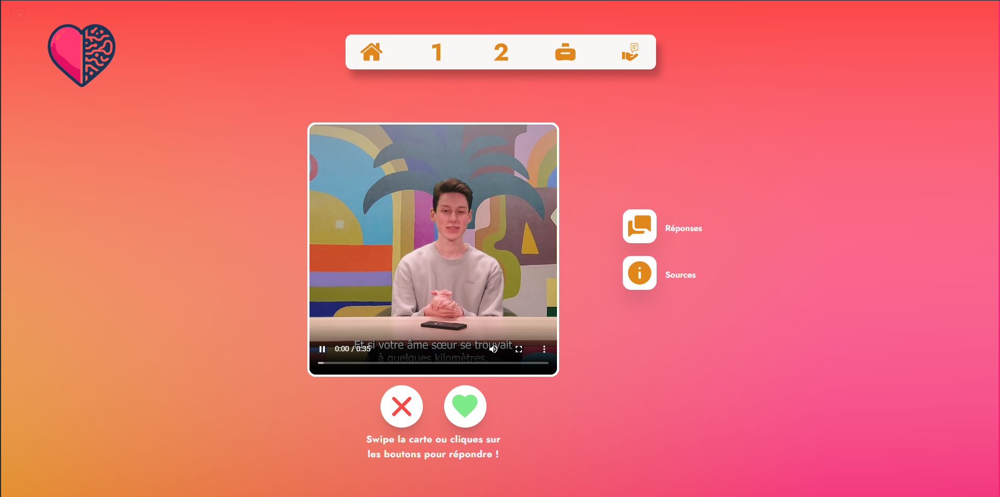
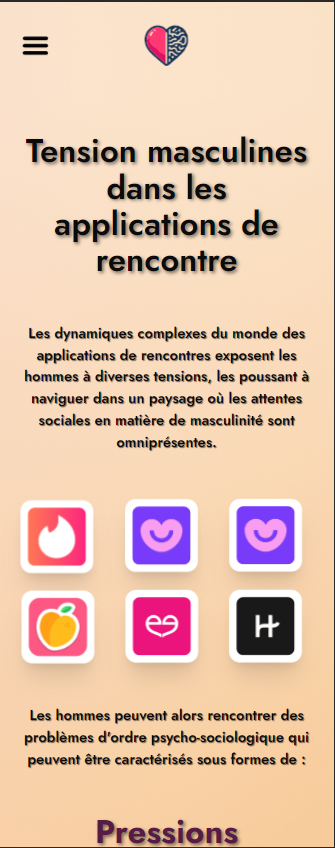

C'est un projet universitaire sous forme de webdocumentaire qui explore le thème des applications de rencontres. Le site vise à dévoiler les divers enjeux associés à ces plateformes, en se concentrant particulièrement sur les expériences masculines.

## Table des matières

- [Aperçu](#aperçu)
  - [Le défi](#le-défi)
  - [Capture d'écran](#capture-décran)
  - [Liens](#liens)
  - [Construit avec](#construit-avec)
- [Auteur](#auteur)

## Aperçu

### Le défi

- Créer un site web interactif doté d'un contenu à la fois crédible et professionnel.

### Capture d'écran

### Liens

- [URL du site en direct](https://webdoc-dating-app.netlify.app)

### Construit avec

- React
- TailwindCSS
- [TinderCard](https://github.com/3DJakob/react-tinder-card)
- React Context

## Auteur

- [Bonefons Alexandre](https://github.com/CallMeAl3x)
- [Prévot Maxime](https://github.com/Lirido1404)